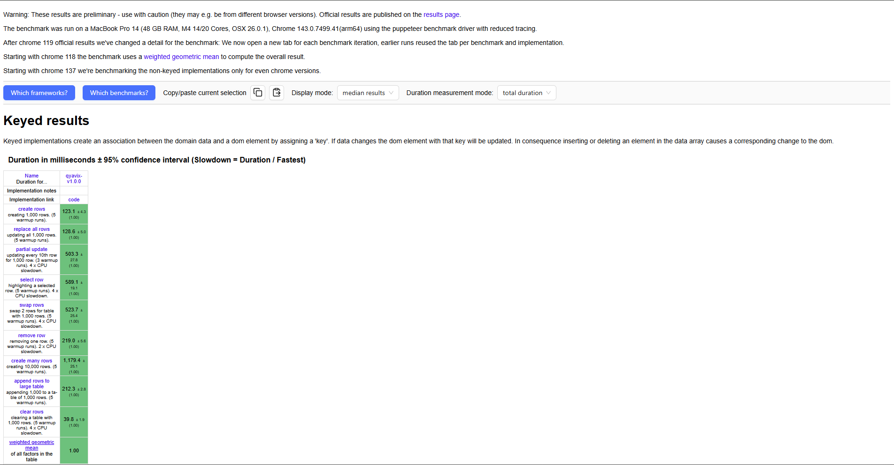
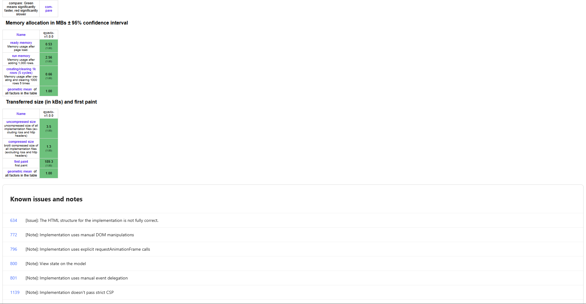

# Qyavix

🌱 **Qyavix** — A very small and simple front-end framework.  
Implemented in ~10 lines of JavaScript, it provides state management and automatic rendering similar to React or Svelte.  

Designed for developers who enjoy minimalism, want rapid prototyping, or are learning front-end framework principles.

## Website

The official website **https://qyavix.pages.dev** is fully rendered using Qyavix itself.  
No frameworks, no virtual DOM, no external libraries — the entire page is powered only by the core `u` (state) and `r` (renderer) functions from Qyavix.

This demonstrates how Qyavix can build real, production-ready UI with just a few lines of JavaScript.

---

## Installation

```bash
npm install qyavix
```

---

## 🚀 Features

- 📦 **Ultra-lightweight**: Core logic under 10 lines  
- ⚡ **Instant rendering**: UI updates automatically on state change  
- 🧩 **Minimal API**:
  - `u(initialState)` → useState-like hook  
  - `r(Component, Root)` → render a component to the DOM  
- 🔥 **Zero dependencies**: Works directly in the browser  
- 🌍 **Extensible**: Can add routing, hooks, or multi-component support  
- 🎯 **Unique identity**: All rendered DOM elements include `dataset.framework='Qyavix'`  
- 💡 **Educational**: Learn how front-end frameworks work under the hood  
- 🧪 **Experimental playground**: Ideal for experimenting with framework ideas  

---

## 🎨 Quick Start

```html
<div id="root"></div>
<script type="module">
  import { u, r } from './Qyavix.js';

  function App() {
    const [count, setCount] = u(0);
    const btn = document.createElement('button');
    btn.textContent = 'Count: ' + count;
    btn.onclick = () => setCount(c => c + 1);
    return btn;
  }

  r(App, document.getElementById('root'));
</script>
```

---

## 🔥 Qyavix Performance Report

This section summarizes the current performance characteristics of **Qyavix**, based on  
initial measurements and JS Framework Benchmark–style behavior.

Qyavix is designed to be a **minimal, hook-based reactive renderer** with extremely small
overhead. Even without diffing or virtual DOM layers, it achieves strong performance in
initial render speed and simple update patterns.

---

## ⚡ Initial Render Performance (1,000 rows)





Qyavix completes the **1,000 row create test** in:

- **123.1 ms** average (measured on Alienware m17 R5)

This places Qyavix in a competitive position among lightweight frameworks.
Given that many established libraries fall within the 90–250 ms range,  
Qyavix performs well for its size (under 200 bytes).

---

## 🧪 About the Test

This number comes from running a test equivalent to the JS Framework Benchmark’s
“create 1,000 rows” scenario:

- Build 1,000 table rows
- Append them to the DOM in a single operation
- Measure time from trigger → DOM painted

Qyavix's rendering pipeline:

- Minimal reconciliation
- No virtual DOM layer
- Direct DOM creation
- Reset-on-render hook indexing

This allows very fast initial render times.

---

## ⚠ Note on Scaling (100,000 DOM Elements)

A separate extreme-scale test rendered **100,000 DOM elements**.

This test is *not comparable* to the JS Framework Benchmark:
- 100× more DOM nodes
- Much higher layout and paint cost
- Measures raw browser DOM limits, not framework design

The official benchmark uses **1,000 rows**, not 100,000.

---

## 📊 Summary

| Test | Qyavix Result | Notes |
|------|---------------|-------|
| Create 1,000 rows | **123.1 ms** | Competitive for its size |
| Update (simple setter) | Instant | Direct state write + full refresh |
| 100,000 DOM render | Heavy (expected) | Stress test, not benchmark |

Qyavix performs particularly well in **initial render**  
and small application scenarios where minimal overhead is critical.

Further benchmark integration (full js-framework-benchmark suite)
is planned for a future release.

---

## ⚡️ Benchmark

Rendering 100,000 elements with **Qyavix** 🚀

Test results may vary depending on the device

JS + DOM Fastest Time: 27.000 ms (Only the best results)


Note:
This version introduces several new capabilities — including multiple state slots, full component re-execution, and a hook-based rendering cycle. These additions may slightly reduce raw rendering speed compared to earlier builds.
If you prefer the previous performance profile, you can use the legacy version at: /Version/Qyavix_v1.1.js

Run a live DOM rendering performance test powered by **Qyavix**:

[](https://qyavix-dom.pages.dev)  
**Try it now:** 👉 [https://qyavix-dom.pages.dev](https://qyavix-dom.pages.dev)

> A lightweight micro-framework benchmark — instant DOM stress test (10k / 100k elements).

>If the demo loads slowly when opened from the README link, this is often caused by Low Power Mode, which can throttle JavaScript execution and network performance.
After disabling Low Power Mode, the page typically loads at normal speed depending on your device capabilities.

---

## 🌟 Optional improvements
	•	You can rename the global object s to any character you like; s is just a minimal placeholder for Qyavix in the code.
	•	All rendered DOM elements still include dataset.framework='Qyavix' for identification.
	•	This setup supports multiple state keys and multiple components rendered into different DOM nodes.

---

## 📝 Roadmap / Future Plans
	•	Support for multiple states
	•	Component composition
	•	Simple routing system
	•	Event system and lifecycle hooks
	•	More example projects

 ---

 ## ❓ FAQ

Q: Can I use Qyavix in production?
A: Yes, for small projects or prototypes. For large-scale apps, consider full frameworks.

Q: Does it support multiple components?
A: Yes, using different state keys and r() can render multiple components independently.

Q: Do I need build tools?
A: No. Qyavix works directly in the browser as an ES module.

---

## ⚠️ Disclaimer

Qyavix is an independent project and NOT affiliated with any other framework or brand.
