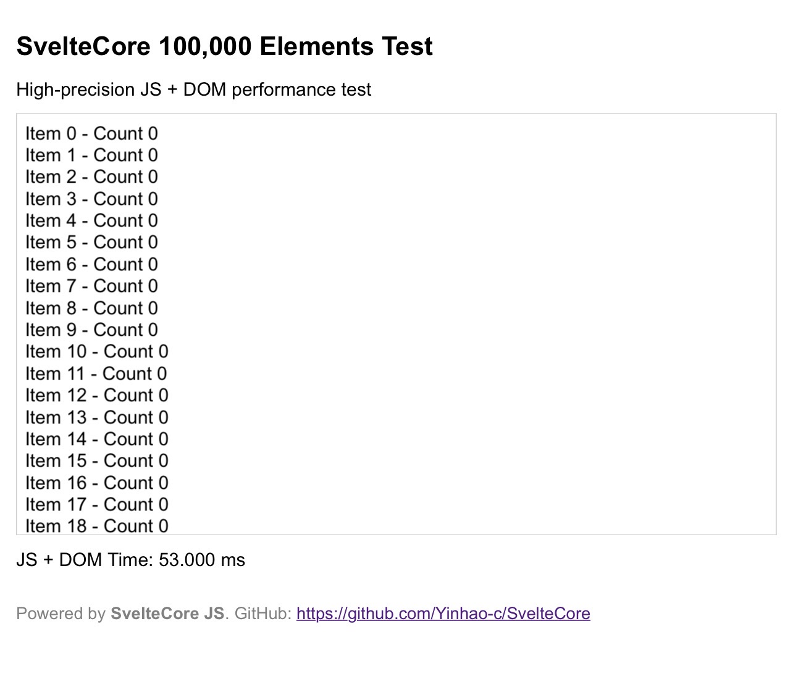

# SvelteCore

🌱 **SvelteCore** — A very small and simple front-end framework.  
Implemented in ~10 lines of JavaScript, it provides state management and automatic rendering similar to React or Svelte.  

Designed for developers who enjoy minimalism, want rapid prototyping, or are learning front-end framework principles.

You can call the website I have built: https://cdn.sveltecore.cyh.us.kg/SvelteCore.js. The URL may be invalid. I suggest you test it in advance.

⚠️ Disclaimer: This project is independent and NOT affiliated with the official Svelte framework.
The name "Svelte" is used to convey that this framework is slim, lightweight, and elegant.

---

## 🚀 Features

- 📦 **Ultra-lightweight**: Core logic under 10 lines  
- ⚡ **Instant rendering**: UI updates automatically on state change  
- 🧩 **Minimal API**:
  - `u(initialState)` → useState-like hook  
  - `r(Component, Root)` → render a component to the DOM  
- 🔥 **Zero dependencies**: Works directly in the browser  
- 🌍 **Extensible**: Can add routing, hooks, or multi-component support  
- 🎯 **Unique identity**: All rendered DOM elements include `dataset.framework='SvelteCore'`  
- 💡 **Educational**: Learn how front-end frameworks work under the hood  
- 🧪 **Experimental playground**: Ideal for experimenting with framework ideas  

---

## 🎨 Quick Start

```html
<div id="root"></div>
<script type="module">
  import { u, r } from './SvelteCore.js';

  function App() {
    const [count, setCount] = u(0);
    const btn = document.createElement('button');
    btn.textContent = 'Count: ' + count;
    btn.onclick = () => setCount(c => c + 1);
    return btn;
  }

  r(App, document.getElementById('root'));
</script>
```

---

## ⚡️ Benchmark

Rendering 100,000 elements with **SvelteCore** 🚀

JS + DOM Fastest Time: 53.000 ms



---

## 🌟 Optional improvements
	•	You can rename the global object s to any character you like; s is just a minimal placeholder for SvelteCore in the code.
	•	All rendered DOM elements still include dataset.framework='SvelteCore' for identification.
	•	This setup supports multiple state keys and multiple components rendered into different DOM nodes.

---

## 📝 Roadmap / Future Plans
	•	Support for multiple states
	•	Component composition
	•	Simple routing system
	•	Event system and lifecycle hooks
	•	More example projects

 ---

 ## ❓ FAQ

Q: Can I use SvelteCore in production?
A: Yes, for small projects or prototypes. For large-scale apps, consider full frameworks.

Q: Does it support multiple components?
A: Yes, using different state keys and r() can render multiple components independently.

Q: Do I need build tools?
A: No. SvelteCore works directly in the browser as an ES module.

---

## ⚠️ Disclaimer

SvelteCore is an independent project and is NOT affiliated with or endorsed by the official Svelte framework. 
The name "Svelte" is used to convey that this framework is slim, lightweight, and elegant.

